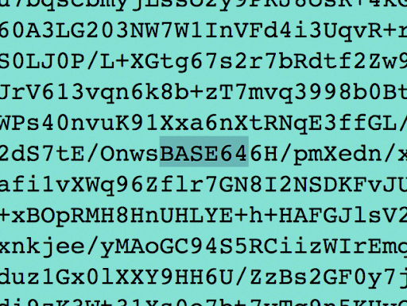
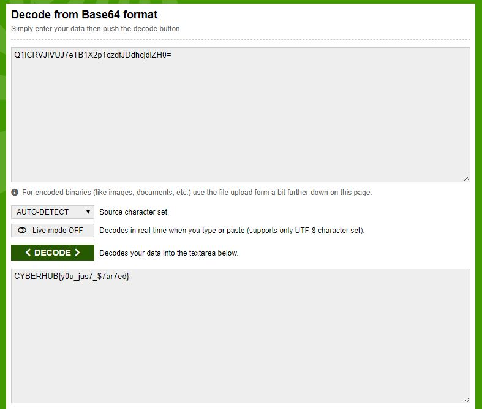

# From the BASE - من القاعدة

You received the following encrypted message from the base station number 64: Q1lCRVJIVUJ7eTB1X2p1czdfJDdhcjdlZH0=

decrypt the message.

Flag format is CYBERHUB{...}

# Write up - الحل
<br />

التلميح زودنا برسالة مشفرة وذكر انها من المحطة رقم 64
<br />
ومن التلميح نستطيع الاستنتاج بأن الرسالة مشفرة بتشفير من نوع
<br />
Base64

<br />



<br />

الان نستطيع فك التشفير بإستخدام أي اداة لفك التشفير
<br />

 


<br />


مبروك :)

<br />
<br />

```
Flag :  CYBERHUB{y0u_jus7_$7ar7ed}
```
