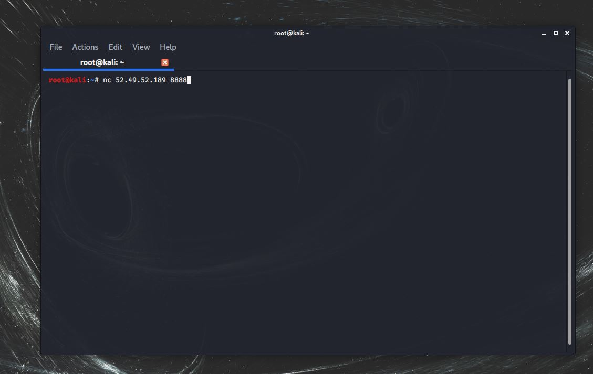
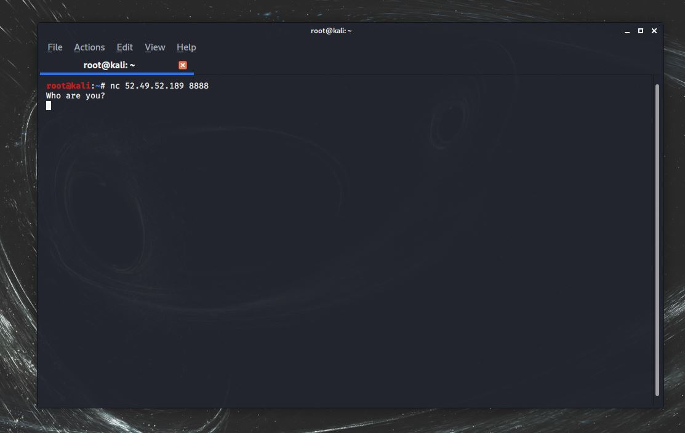
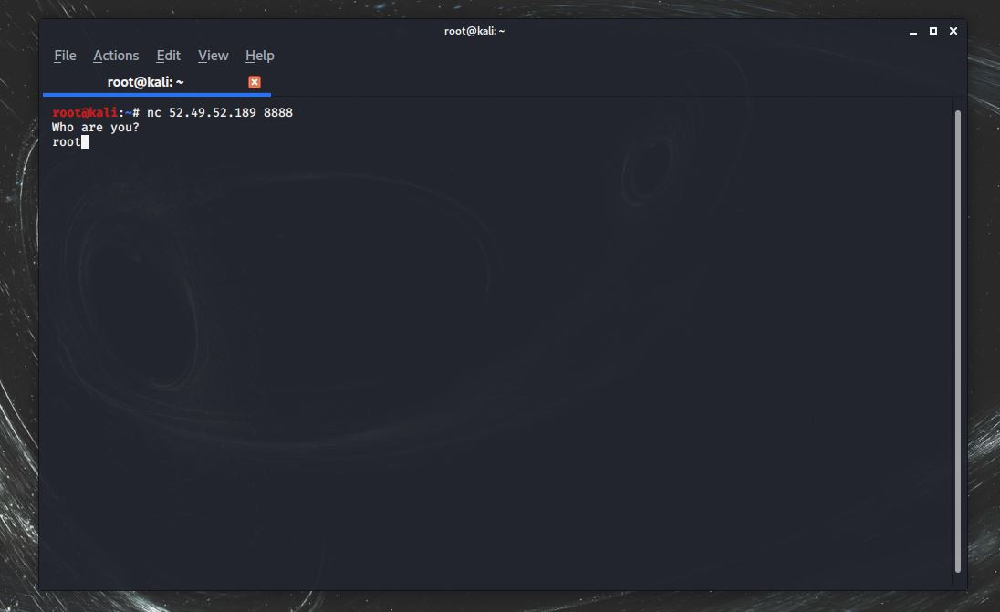

# Who Are You? - من أنت؟

Only root can talk to me, no one else

nc 52.49.52.189 8888

Flag format is CYBERHUB{...}

# Write up - الحل
<br />

التلميح زودنا برقم آي بي وبورت وذكر أمر لأداة
<br />
Netcatالـ
<br />
لذا نجرب استخدام الأمر في تيرمينال لينكس




<br />

بعد استخدامنا للاداة على الآي بي المُعطى, نلاحظ رسالة تنبثق
<br />
"Who Are You?" 
<br />
وتنتظر إدخال
 


<br />

نستطيع ان نتذكر من التلميح أن الرووت هو الوحيد الذي يستطيع التحدث إليه 
<br />
"Only root can talk to me" 
<br />
لذا نُدخل
<br />
root 



<br />
.. انتظر قليلاً
<br />

<br />

مبروك :)

<br />
<br />

```
Flag :  CYBERHUB {curi0sity_ki11s_ne7cat}
```
