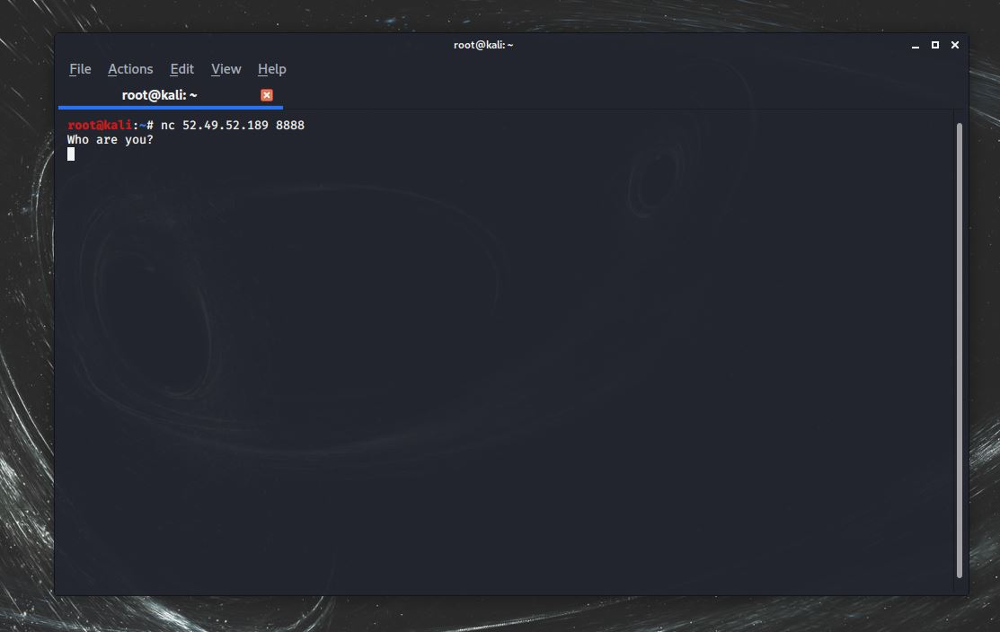
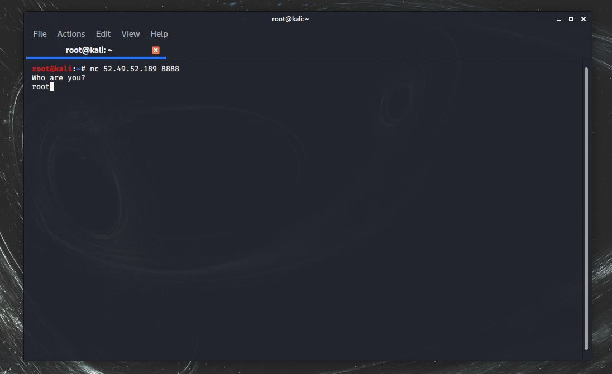
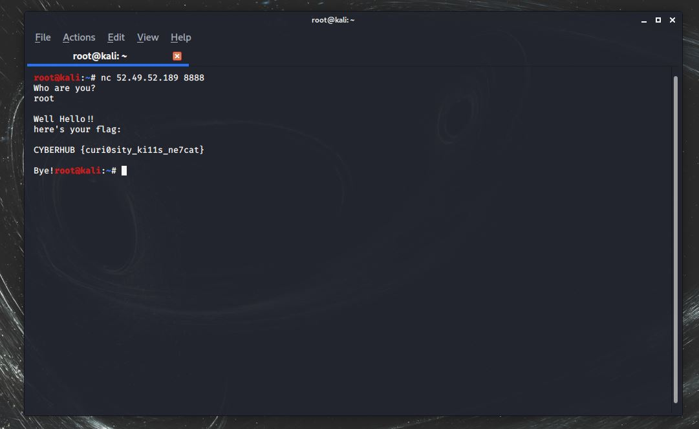

# Who Are You?

Only root can talk to me, no one else

nc 52.49.52.189 8888

Flag format is CYBERHUB{...}

# Write up
<br />

The hint gave us an IP & Port and mentioned NCAT command (nc), so we try to use it on linux.


<br />

Now after we used NCAT on the IP from the hint, a message pops out saying "Who are you?" and waiting for an input



<br />

We can remember from the hint that "Only root can talk to me", so we enter root



<br />

Wait a few seconds ...



<br />

Congratulations :)

<br />
<br />

```
**Flag** :  CYBERHUB {curi0sity_ki11s_ne7cat}
```
